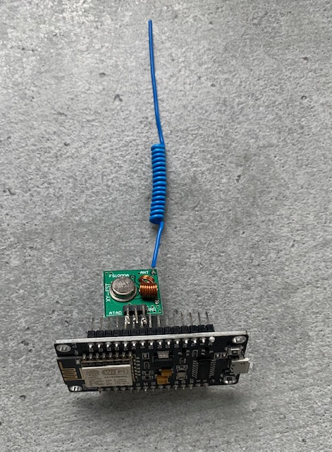

# Homeassistant AOK Blinds management

This repo contains 3 parts:
- The communication between an ESP8266 and a/several a AOK blinds, using RTS technology (RF 433MHz)
- The pairing of the homemade remote and the blind(s)
- The integration of those blinds to Homeassistant using MQTT. This integration allow positioning of the blinds in a specific position.


## ESP8266

### Hardware
You will need an ESP8266 and a RF emitter. 
- I'm using a NodeMCU for the ESP 
- I'm using a simple rf emitter like [the FS1000A](https://search.brave.com/images?q=rf+433+emitter+fs1000A&source=web)
- To make the emitter more powerfull, I used [this tutorial](https://www.instructables.com/433-MHz-Coil-loaded-antenna/) to create a home made antenna. Works like a charm

Just connect the Data pin of the RF emitter to the pin A4 (pin id 2), the ground to the ground and the Vcc to the 3V of the ESP.



### Software
The arduino code principle is the following : it receives an mqtt message with the channel corresponding to one/several blinds and with an action, and it send the corresponding signal to the RF emitter.

See the code of `aok_remote.ino`. The code of this sketch is heavily inspired from [akirjavainen's repo](https://github.com/akirjavainen/A-OK), thanks a lot for his work
- Adapt the information concerning the wifi connection
- Adapt the information concerning your mqtt broker
- Choose your own remote id for your remote. It can be whatever between 1 and 2^16.
- You can adapt the topic the code lisens to, but if you do, it will have impact on homeassistant side. 

The DIY remote we just created can handle up to 16 blinds. You can adapt the code to handle as many blinds as you want but then you will have to deal with several remote ids.

## Pairing your new DIY remote
We use the tutorial of the blinds to do that : [user manual](https://www.aokfrance.com/ressources/common/Notices/NOTICE_AM25_35_45-ES-E.pdf) (in French)

- Push STOP during 5 seconds on the remote alread working with your first blind. The blind will make a little movement
- Send an mqtt message: 
  - Topic: `cmd/blinds_etage1a/01` (`01` represents the channel)
  - Payload: `u` (for `up`)
- The blind will make a little movement
And thats is, your DIY remote can now control your blind on the channel 1.  You can send `u` (for `up`) on the same topic to open your blind, `d` (for `down`) to close it or `s` (for `stop`) to stop it.

Do the same with your second blind, but with `02` instead of `01`.

Do the same with your third blind, but with `04`.

Do the same with your fourth blind, but with `08`.

Do the same with your fifth blind, but with `16`.

Do the same with your sixth blind, but with `32`.

Notice that you have to double the channel each time. Why? Each channel correspond, in a binary reprentation, to a series of `0` with a single `1`:
```
01 == 00000000 00000001
02 == 00000000 00000010
04 == 00000000 00000100
08 == 00000000 00001000
16 == 00000000 00010000
32 == 00000000 00100000
```
That way, if you want to open blinds with channels 01, 04 and 16 at the same time, you can send 21 :
```
01 ==     00000000 00000001
04 ==     00000000 00000100
16 ==     00000000 00010000
-----------------------
1+4+16 -> 00000000 00010101 == 21  
```

(!) Note that the current code only works with channels up to 32 (6 blinds) because we expect the channel to be on 2 digits, the code can be adapted to manage more channels if needed. 

## Homeassistant configuration

What we will do here :
- Configuration of the blinds
- Creation of the blueprints
- Creation of the automations

### Configuration of the blinds

Each blind will have to be configured this way :
```
  - name: Volet Cuisine 1
    object_id: volet_cuisine_1
    device_class: blind
    command_topic: cmd/blinds_etage1a/01    # same topic as the one configured in the ESP code
    payload_close: 'd'
    payload_open: 'u'
    payload_stop: 's'
    position_topic: cmd/blinds_etage1a_position/01
    position_open: 100
    position_closed: 0
    set_position_topic: cmd/blinds_etage1a_set_position/01
    optimistic: false
```
Replace the `01` with the channel of the blind.  

### Creation of the blueprints
We will create 3 blueprints:
- The first one that will catch the 'closing' event: see `volet_down.yaml`. 
- The second one that will catch the 'opening' event: see `volet_down.yaml`
- The third one that will catch the position setting mqtt message: see `volet_change_pos.yaml`

The first and the second blueprints does the following : 
- It starts when receiveing (from HA) a closing or opening message. 
- It will wait for the stop signal, 
- Once received, in function of the initial position + the time between the closing/opening signal and the stop, it will update the position. 
- If no stop signal is received, it will consider the blinds as beeing completely close/open. 

The third blueprint changees the position of the blind :
- It will be triggered by a change of position sent to mqtt broker by HA 
- It will send the up/down command to the blind (depending on the current position beeing below/above the requested position)
- It will wait for a period of time computed using the total time for the blind to fully close/open and the difference of the current & requested position
- It will send the stop signal   

### Creation of the automations
We will create 4 kinds of automation:
- The first one aim to trigger an event in HA when a command to open/close/stop a blind is sent: see `mqtt_to_event.yaml`. This is needed because in the above blueprint we wait for the `stop` command through a `wait_for_trigger`, and we can't wait for an mqtt message, only for an event.
- The 2nd, 3rd and fourth needs to be created for each blinds. Example for one blind:
```
  - id: volet_cuisine_1_position_close
    alias: 'Set position to volet cuisine 1 (close)'
    use_blueprint:
      path: volet_down.yaml
      input:
        cover_id: cover.volet_cuisine_1
        id: 1
        time_all_way: 23
  - id: volet_cuisine_1_position_open
    alias: 'Set position to volet cuisine 1 (open)'
    use_blueprint:
      path: volet_up.yaml
      input:
        cover_id: cover.volet_cuisine_1
        id: 1
        time_all_way: 23
  - id: volet_cuisine_1_set_position
    alias: 'Change position to volet cuisine 1'
    use_blueprint:
      path: volet_change_pos.yaml
      input:
        cover_id: cover.volet_cuisine_1
        id: 1
        time_all_way: 23
```

  - The `cover_id` is the entity id of the blind
  - The `id` is the channel id (1, 2, 4, 8, 16, 32...)
  - The `time_all_way` is the time (in secondes) your blind takes to fully close/open.
